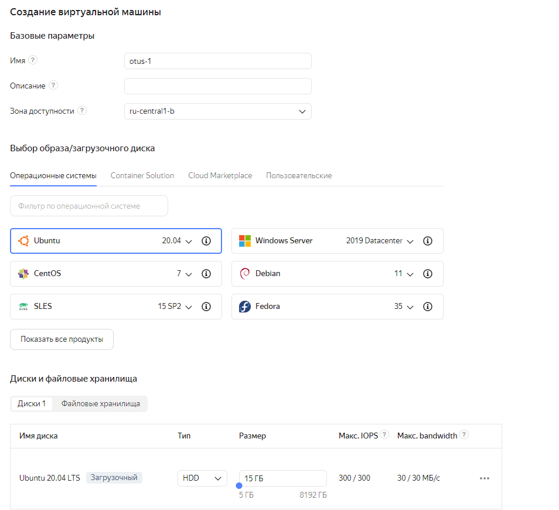
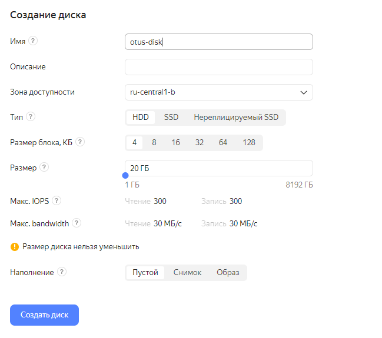
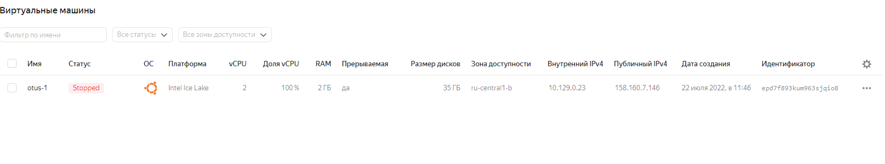

# **Введение**

Физический уровень PostgreSQL

# **Подготовка виртуальной машины**

Создадим ВМ


Установим postgres
```
snekrasov@otus-1:~$ sudo su
root@otus-1:/home/snekrasov# apt update && sudo DEBIAN_FRONTEND=noninteractive apt upgrade -y -q &&  sh -c 'echo "deb http://apt.postgresql.org/pub/repos/apt $(lsb_release -cs)-pgdg main" > /etc/apt/sources.list.d/pgdg.list' && wget --quiet -O - https://www.postgresql.org/media/keys/ACCC4CF8.asc |  apt-key add - && apt-get update &&  DEBIAN_FRONTEND=noninteractive apt -y install postgresql-14
Hit:1 http://mirror.yandex.ru/ubuntu focal InRelease
Get:2 http://mirror.yandex.ru/ubuntu focal-updates InRelease [114 kB]
Get:3 http://mirror.yandex.ru/ubuntu focal-backports InRelease [108 kB]                 
Get:4 http://security.ubuntu.com/ubuntu focal-security InRelease [114 kB]    
Get:5 http://mirror.yandex.ru/ubuntu focal-updates/main i386 Packages [696 kB]
Get:6 http://mirror.yandex.ru/ubuntu focal-updates/main amd64 Packages [1,990 kB]
Get:7 http://mirror.yandex.ru/ubuntu focal-updates/main Translation-en [358 kB]            
Get:8 http://mirror.yandex.ru/ubuntu focal-updates/main amd64 c-n-f Metadata [15.6 kB]
Get:9 http://mirror.yandex.ru/ubuntu focal-updates/restricted amd64 Packages [1,178 kB]
Get:10 http://mirror.yandex.ru/ubuntu focal-updates/restricted Translation-en [167 kB]
...
```
Проверим кластер
```
root@otus-1:/home/snekrasov# pg_lsclusters
Ver Cluster Port Status Owner    Data directory              Log file
14  main    5432 online postgres /var/lib/postgresql/14/main /var/log/postgresql/postgresql-14-main.log
```

Заполним данными
```
postgres=# create table test(c1 text); 
postgres=# insert into test values('1');
CREATE TABLE
INSERT 0 1
postgres=# select * from test;
 c1
----
 1
(1 row)

```
Останавливаем кластер
```
root@otus-1:/home/snekrasov# pg_ctlcluster 14 main stop
root@otus-1:/home/snekrasov# pg_lsclusters
Ver Cluster Port Status Owner    Data directory              Log file
14  main    5432 down   postgres /var/lib/postgresql/14/main /var/log/postgresql/postgresql-14-main.log
```
# **Подготовка диска**
Создадим диск и подключим диск


Установим parted
```
root@otus-1:/home/snekrasov# apt install parted
Reading package lists... Done
Building dependency tree
Reading state information... Done
parted is already the newest version (3.3-4ubuntu0.20.04.1).
0 upgraded, 0 newly installed, 0 to remove and 0 not upgraded.
```
Уже есть!

Проверим что диск подключен
```
root@otus-1:/home/snekrasov# parted -l | grep Error
Error: /dev/vdb: unrecognised disk label
root@otus-1:/home/snekrasov# lsblk
NAME   MAJ:MIN RM SIZE RO TYPE MOUNTPOINT
vda    252:0    0  15G  0 disk
├─vda1 252:1    0   1M  0 part
└─vda2 252:2    0  15G  0 part /
vdb    252:16   0  20G  0 disk
```
Создаем раздел
```
root@otus-1:/home/snekrasov# parted /dev/vdb mklabel gpt
Information: You may need to update /etc/fstab.

root@otus-1:/home/snekrasov# parted -a opt /dev/vdb mkpart primary ext4 0% 100%
Information: You may need to update /etc/fstab.

root@otus-1:/home/snekrasov# lsblk
NAME   MAJ:MIN RM SIZE RO TYPE MOUNTPOINT
vda    252:0    0  15G  0 disk
├─vda1 252:1    0   1M  0 part
└─vda2 252:2    0  15G  0 part /
vdb    252:16   0  20G  0 disk
└─vdb1 252:17   0  20G  0 part

```
Создаем файловую систему
```
root@otus-1:/home/snekrasov# mkfs.ext4 -L datapartition /dev/vdb1
mke2fs 1.45.5 (07-Jan-2020)
Creating filesystem with 5242368 4k blocks and 1310720 inodes
Filesystem UUID: 7e9f619d-a665-4999-9cf8-645efa9d9f14
Superblock backups stored on blocks:
        32768, 98304, 163840, 229376, 294912, 819200, 884736, 1605632, 2654208,
        4096000

Allocating group tables: done
Writing inode tables: done
Creating journal (32768 blocks): done
Writing superblocks and filesystem accounting information: done

root@otus-1:/home/snekrasov# lsblk
NAME   MAJ:MIN RM SIZE RO TYPE MOUNTPOINT
vda    252:0    0  15G  0 disk
├─vda1 252:1    0   1M  0 part
└─vda2 252:2    0  15G  0 part /
vdb    252:16   0  20G  0 disk
└─vdb1 252:17   0  20G  0 part

root@otus-1:/home/snekrasov# lsblk -fs
NAME  FSTYPE LABEL         UUID                                 FSAVAIL FSUSE% MOUNTPOINT
vda1
└─vda
vda2  ext4                 82afb880-9c95-44d6-8df9-84129f3f2cd1   11.5G    18% /
└─vda
vdb1  ext4   datapartition 7e9f619d-a665-4999-9cf8-645efa9d9f14
└─vdb
```
Создадим и монтируем папку
```
root@otus-1:/home/snekrasov# mkdir -p /mnt/data
root@otus-1:/home/snekrasov# mount -o defaults /dev/vdb1 /mnt/data
root@otus-1:/home/snekrasov# df -h -x tmpfs
Filesystem      Size  Used Avail Use% Mounted on
udev            963M     0  963M   0% /dev
/dev/vda2        15G  2.6G   12G  19% /
/dev/vdb1        20G   24K   19G   1% /mnt/data

```
Папка смонтированна.


# **Перенос файлов postgres**

```
root@otus-1:/home/snekrasov# chown  postgres:postgres -R /mnt/data/
root@otus-1:/home/snekrasov# ls /mnt -l
total 4
drwxr-xr-x 3 postgres postgres 4096 Jul 22 07:12 data

root@otus-1:/home/snekrasov# mv /var/lib/postgresql/14 /mnt/data
```

Запуск кластера

```
root@otus-1:/home/snekrasov# pg_ctlcluster 14 main start
Error: /var/lib/postgresql/14/main is not accessible or does not exist
```
Не удалось запустить т.к. нет директории /var/lib/postgresql/14/

Сменим расположение файлов в конфиге /etc/postgresql/14/main/postgresql.conf
data_directory = '/mnt/data/14/main'

```
root@otus-1:/home/snekrasov# nano /etc/postgresql/14/main/postgresql.conf
root@otus-1:/home/snekrasov# pg_ctlcluster 14 main start
root@otus-1:/home/snekrasov# pg_lsclusters
Ver Cluster Port Status Owner    Data directory     Log file
14  main    5432 online postgres /mnt/data/14/main/ /var/log/postgresql/postgresql-14-main.log
root@otus-1:/home/snekrasov# sudo -u postgres psql
psql (14.4 (Ubuntu 14.4-1.pgdg20.04+1))
Type "help" for help.

postgres=# show data_directory;
  data_directory
-------------------
 /mnt/data/14/main
(1 row)

```

Кластер запущен из новой директории!

```
postgres=# select * from test;
 c1
----
 1
(1 row)
```
Данные на месте.

Остановлю первую ВМ, она больше не нужна.



# **Перенос диска на другую ВМ**

Создадим вторую ВМ и выполним все шаги как для первой.


Далее, остановим кластер
```
root@otus-2:/home/snekrasov# pg_lsclusters
Ver Cluster Port Status Owner    Data directory              Log file
14  main    5432 online postgres /var/lib/postgresql/14/main /var/log/postgresql/postgresql-14-main.log
root@otus-2:/home/snekrasov# pg_ctlcluster 14 main stop
root@otus-2:/home/snekrasov# pg_lsclusters
Ver Cluster Port Status Owner    Data directory              Log file
14  main    5432 down   postgres /var/lib/postgresql/14/main /var/log/postgresql/postgresql-14-main.log

```
Удалим файлы
```
root@otus-2:/home/snekrasov# rm -rf /var/lib/postgresql/*
root@otus-2:/home/snekrasov# ls /var/lib/postgresql/

```
Присоеденим диск через веб.

```
root@otus-2:/home/snekrasov# lsblk -fs
NAME  FSTYPE LABEL         UUID                                 FSAVAIL FSUSE% MOUNTPOINT
vda1
└─vda
vda2  ext4                 82afb880-9c95-44d6-8df9-84129f3f2cd1   11.5G    17% /
└─vda
vdb1  ext4   datapartition 7e9f619d-a665-4999-9cf8-645efa9d9f14
└─vdb
```
Монтируем

```
root@otus-2:/home/snekrasov# mkdir -p /mnt/data
root@otus-2:/home/snekrasov# chown -R postgres:postgres /mnt/data/
root@otus-2:/home/snekrasov# mount -o defaults /dev/vdb1 /mnt/data
root@otus-2:/home/snekrasov# lsblk -fs
NAME  FSTYPE LABEL         UUID                                 FSAVAIL FSUSE% MOUNTPOINT
vda1
└─vda
vda2  ext4                 82afb880-9c95-44d6-8df9-84129f3f2cd1   11.5G    17% /
└─vda
vdb1  ext4   datapartition 7e9f619d-a665-4999-9cf8-645efa9d9f14   18.5G     0% /mnt/data
└─vdb

```


Аналогично первой мащине правим конфиг
```
nano /etc/postgresql/14/main/postgresql.conf
```

Запускаем кластер
```
root@otus-2:/home/snekrasov# pg_ctlcluster 14 main start
root@otus-2:/home/snekrasov# pg_lsclusters
Ver Cluster Port Status Owner    Data directory     Log file
14  main    5432 online postgres /mnt/data/14/main/ /var/log/postgresql/postgresql-14-main.log

```

Проверим данные
```
root@otus-2:/home/snekrasov# sudo -u postgres psql
psql (14.4 (Ubuntu 14.4-1.pgdg20.04+1))
Type "help" for help.

postgres=# select * from test;
 c1
----
 1
(1 row)

```
Данные созданные на первой ВМ доступны на второй, потому что мы скопировали их на внешний диск.